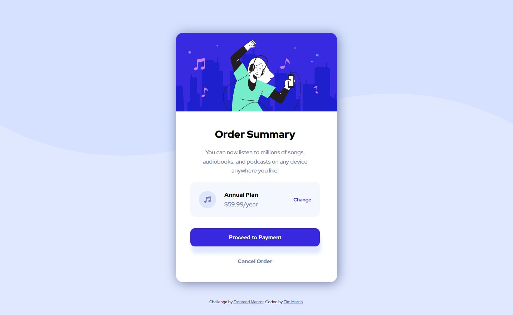

# Frontend Mentor - Order summary card solution

This is a solution to the [Order summary card challenge on Frontend Mentor](https://www.frontendmentor.io/challenges/order-summary-component-QlPmajDUj). Frontend Mentor challenges help you improve your coding skills by building realistic projects. 

## Table of contents

- [Overview](#overview)
  - [The challenge](#the-challenge)
  - [Screenshot](#screenshot)
  - [Links](#links)
- [My process](#my-process)
  - [Built with](#built-with)
  - [What I learned](#what-i-learned)
  - [Continued development](#continued-development)
  - [Useful resources](#useful-resources)
- [Author](#author)


## Overview

### The challenge

Users should be able to:

- See hover states for interactive elements

### Screenshot




### Links

- Solution URL: [Frontend Mentor](https://your-solution-url.com)
- Live Site URL: [Github Pages](https://timmartin13-frontend-mentor.github.io/order-summary-component/)

## My process

### Built with

- Semantic HTML5 markup
- CSS modules
- Flexbox
- Mobile-first workflow
- [React](https://reactjs.org/) - JS library


### What I learned

During this challenge, I learned how to break up my CSS into modules and import them into my React components. I also, learned how to host a React app on github pages.

```js
import attributionStyles from "./Attribution.module.css";

function Attribution() {
  return (
    <div class={ attributionStyles.attribution }>
      ...
    </div>
  )
}
```

### Continued development

I am going to continue to develop in React. I may try out styled-components for my next CSS adventure in React.


### Useful resources

- [Hosting React on Github pages](https://www.c-sharpcorner.com/article/how-to-deploy-react-application-on-github-pages/) - This helped me to get my React app up on github pages
- [Separating CSS into modules](https://bootcamp.uxdesign.cc/using-css-modules-in-react-cc17f7c81247) - A walkthrough of how to separate your CSS into component based modules.


## Author

- Website - [My portfolio](https://timmartin13.github.io/react-portfolio/)
- Frontend Mentor - [@TimMartin13](https://www.frontendmentor.io/profile/TimMartin13)
